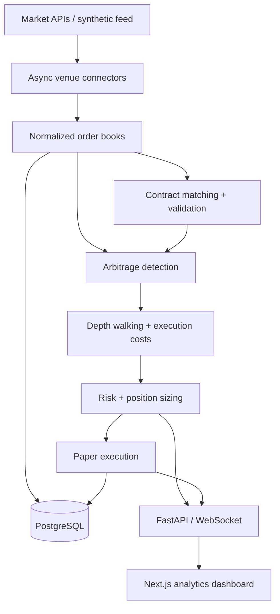

# Prediction Market Arbitrage Engine

**Asynchronous market-data ingestion, depth-aware arbitrage analysis, and paper execution—with a streaming research dashboard.**

A full-stack quantitative engineering project built with **Python, FastAPI, PostgreSQL, and Next.js**. It evaluates whether prediction-market price discrepancies survive fees, available liquidity, slippage, and capital constraints, then records the execution decision and simulated fills for inspection.

[Live observation](docs/LIVE_RUN.md) · [Recorded demo](docs/DEMO_RESULTS.md) · [Architecture](ARCHITECTURE.md) · [Execution model](docs/EXECUTION_MODEL.md) · [Validation](docs/VALIDATION.md)

## Engineering results

| Evidence | Measured result |
| --- | --- |
| Research-path throughput | **7,230 snapshots/s · 4,820 arbitrage checks/s** |
| Detection latency | **0.077 ms p50 · 0.105 ms p95** per pair |
| Automated verification | **59 passing tests · 89% backend statement coverage** |
| Full-stack integration | Docker Compose build/start, API data, paper fills, settlement, and PostgreSQL persistence verified |
| Public data connectivity | Polymarket REST + WebSocket refresh and Kalshi REST smoke-tested |

Performance figures are the **mock-path baseline from a local CPU microbenchmark**, not end-to-end venue throughput: 12,000 JSON snapshots and 8,000 checks on macOS arm64 / Python 3.12.11, measured September 9, 2026. Network, database, and browser I/O are excluded. [Raw benchmark and methodology](docs/benchmark.json).

## Recorded demo: from quotes to execution decisions

A fresh run of the deterministic synthetic feed produced **6 venue markets, 12 order books, and 8 checks**: **2 executable**, **2 theoretical but blocked**, and **4 rejected**. Five representative scenarios are shown below.

| Scenario | Gross edge | Net edge | Decision |
| --- | ---: | ---: | --- |
| Fed rate | -2.00% | -2.445% | No positive gross edge |
| Bitcoin | 0.20% | -0.240% | Fees eliminate the edge |
| Ethereum | 5.00% | 4.450% | Executable after walking depth |
| GDP | 7.00% | — | Insufficient depth and liquidity |
| CPI, cross-venue | 5.00% | 2.944% | Executable with validated mapping |

Edges are measured per $1 paired payout, not annualized returns. An incomplete pair has no executable net-edge estimate.

The two executable pairs generated **4 paper fills** and **$7.39376 in simulated P&L** after supplying matching mock YES resolutions. The run also verified duplicate-order rejection and restored the persisted trade ledger with matching capital and P&L.

**These are synthetic functional-demo results, not a backtest or real investment returns.** [Read the full run](docs/DEMO_RESULTS.md) or inspect [every input book, cost estimate, fill, and settlement in JSON](docs/demo-run.json).

## What makes this more than a price-difference scanner?

- **Depth-aware execution:** aggregates and sorts book levels, walks the requested size, and calculates volume-weighted execution prices. A best quote is never assumed to cover the whole order.
- **Explicit costs:** applies trading fees, fee rounding, slippage, network costs, and latency reserves. Buying at asks already accounts for spread, avoiding double counting.
- **Validated contract matching:** title/date normalization and fuzzy similarity identify candidates; cross-venue execution additionally requires an explicit settlement-equivalence mapping.
- **Conservative risk controls:** enforces per-opportunity, per-market, and portfolio capital limits, minimum liquidity, minimum net edge, quote freshness, and timestamp alignment.
- **Auditable paper execution:** revalidates current books under a mutation lock, commits both simulated orders, prevents duplicate depth consumption, and restores positions after restart.

A positive gross edge is **theoretical** until all configured constraints pass. Insufficient depth, stale data, unverified live fees, and unvalidated mappings remain visible with rejection reasons.

## Architecture



| Layer | Technologies and responsibilities |
| --- | --- |
| Market data and quant | Python 3.12, asyncio, Pydantic, Decimal arithmetic; common read-only venue interface |
| API and persistence | FastAPI, WebSockets, async SQLAlchemy, PostgreSQL; SQLite for standalone tests/demo |
| Dashboard | Next.js 16, React 19, TypeScript, Tailwind CSS, Recharts, Radix dialog |
| Engineering | pytest, Ruff, ESLint, Prettier, GitHub Actions, locked dependencies, non-root Docker containers |
| Benchmark analysis | NumPy percentiles and pandas aggregation |

[Service boundaries, database design, and concurrency decisions →](ARCHITECTURE.md)

## Dashboard

The research workspace includes a live opportunity monitor with status filters, a details drawer with a cost waterfall, cumulative order-book depth, stored bid/ask history, a paper portfolio, and connection diagnostics. WebSocket updates use bounded queues; REST polling resynchronizes state after reconnects.

## Run locally

Requires Docker with Compose v2.24+; no venue credentials or funds are needed.

```bash
git clone https://github.com/neilmotiani/prediction-market-arbitrage-engine.git
cd prediction-market-arbitrage-engine
docker compose up --build
```

Open **http://localhost:3000** for the dashboard and **http://localhost:8000/docs** for the interactive API.

The default synthetic feed updates every three seconds and periodically closes profitable windows. Inspect an executable pair, choose **Run paper simulation**, then open **Paper portfolio → Resolve YES** to record mock settlement. `MODE=live` changes the data source only; **real-money execution is not implemented**.

### Run real data with automatic simulated trades

```bash
make live
```

The same dashboard now monitors **real Polymarket order books** and automatically records paper fills only when depth, market-specific fees, freshness, and capital checks pass. It uses a separate persistent ledger, preserves your mock results, and requires no credentials. Final venue resolutions settle supported paper positions; no real orders are sent.

A recorded live observation processed **3,432 snapshots and 1,716 checks across 12 markets** over approximately 8.5 minutes. One positive gross-edge observation failed execution constraints; **zero paper trades** were placed. This demonstrates real ingestion and rejection logic, not profitable live performance. [Observed inputs and metrics](docs/live-run.json) · [Run details](docs/LIVE_RUN.md).

Docker runs in the background; the computer must stay awake and connected. [Live operation, configuration, and limitations](docs/LIVE_DATA.md).

### Reproduce the recorded results

With Python 3.12 and [uv](https://docs.astral.sh/uv/) installed:

```bash
uv sync --frozen
make demo-report   # fresh database; writes docs/DEMO_RESULTS.md and docs/demo-run.json
make mock-data     # compact scenario output
make benchmark     # writes measured CPU results to docs/benchmark.json
make test          # quantitative, API, persistence, and execution tests
```

The report uses explicit default settings and never modifies the running application's database. Timestamps and IDs vary between runs; economic results are deterministic. Benchmark timings vary by machine and load; the README records the dated run above.

[Development commands, API examples, and configuration →](docs/DEVELOPMENT.md)

## Core calculation

```text
gross_edge = 1 - (best_ask_yes + best_ask_no)
net_edge(q) = 1 - VWAP_yes(q) - VWAP_no(q)
                - fees(q)/q - network_cost(q)/q - latency_reserve(q)/q
expected_profit(q) = q × net_edge(q)
```

For matching YES/NO contracts, the combined settlement is $1 per pair. Both legs must fill the same quantity; incomplete pairing produces no executable profit estimate. [Worked examples and units](docs/ARBITRAGE_MATH.md).

## Scope and tradeoffs

- **Research, not live trading:** paper fills assume atomic paired execution. Real venues introduce leg risk, queue competition, transfer constraints, and potentially different settlements. Mock P&L includes modeled costs, not actual financial transactions.
- **Live data with paper execution:** the live preset discovers Polymarket contracts, verifies market-specific fee metadata, simulates qualifying pairs, and polls final resolutions. Unsupported fee schedules block executable classifications. Human-reviewed mappings attest to settlement equivalence; title similarity alone is insufficient.
- **Single-worker local deployment:** the execution lock and exposure ledger are process-owned. Authentication, distributed transaction locking, and schema migrations are required before a shared production deployment.
- **Verification scope:** automated tests and full-stack HTTP/database checks passed. Browser visual and interaction QA remains outstanding; see the [validation record](docs/VALIDATION.md).

Next steps include Kalshi market-specific fees, sequenced book-delta reconciliation, historical replay/backtesting, independent leg-fill modeling, and a dedicated execution service with transactional portfolio locking.

<details>
<summary>Project summary</summary>

Built an asynchronous prediction-market research engine with validated cross-venue matching, depth-aware execution costs, capital-constrained paper trading, and a streaming FastAPI/Next.js dashboard; benchmarked 7,230 normalized snapshots/s and 4,820 arbitrage checks/s at 0.105 ms p95 detection latency in a local CPU benchmark.

</details>

[Contributing](CONTRIBUTING.md) · [MIT License](LICENSE)
