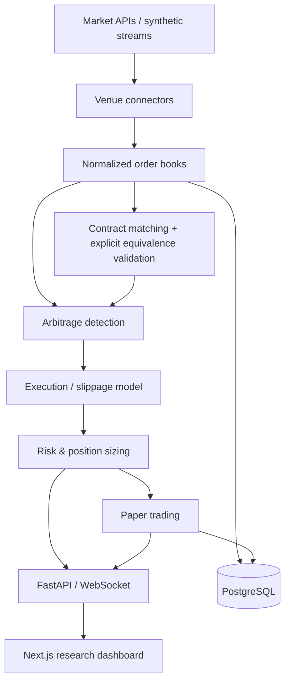

# Prediction Market Arbitrage Engine

**An asynchronous quantitative research system that asks whether an apparent edge survives execution.**

Monitor normalized YES/NO order books, validate cross-venue contract mappings, walk actual depth, subtract trading costs, apply capital limits, and inspect the result in a streaming analytics dashboard. A deterministic synthetic feed makes the entire project demonstrable without credentials, funds, or a venue account.

**Paper execution only.** `MODE=live` changes the data source; it never enables real orders. Executable means *passes the configured simulation constraints*, not a promise of live fills or profit.

## Architecture



See [ARCHITECTURE.md](ARCHITECTURE.md) for service boundaries, concurrency, persistence, and deployment assumptions.

## Dashboard

The dark research workspace contains:

- Current market, theoretical-edge, executable-edge, and realized paper-P&L cards.
- A searchable opportunity table with gross/net edges, size, profit, status filters, and rejection explanations.
- A keyboard-accessible details drawer with both execution legs and a cost waterfall.
- Cumulative bid/ask depth and stored YES bid/ask history, with a market selector.
- Simulated trades, explicit mock YES settlement, capital accounting, and connection diagnostics.
- WebSocket updates with reconnects and HTTP polling fallback; API errors remain visible.

## Arbitrage equations

For a genuinely complementary pair with a combined $1 settlement:

```text
gross_edge = 1 - (best_ask_yes + best_ask_no)
net_edge(q) = 1 - VWAP_yes(q) - VWAP_no(q)
                - fees(q)/q - network_cost(q)/q - latency_reserve(q)/q
expected_profit(q) = q * net_edge(q)
```

Spread is already included because purchases consume **asks**. Slippage is VWAP minus the best ask; do not subtract either twice. Fees, slippage, and execution costs in an `Opportunity` are **dollars per paired share**; each leg's `estimate` reports **total dollars**. Empty or unequal partial fills have `net_edge=null` and `expected_profit=null`.

Example: 100 YES at $0.45 plus 100 NO at $0.50 yields a $0.05 gross edge. At a 20 bps notional fee, $0.02 network cost per leg, and 10 bps latency reserve per leg, the net edge is $0.0457/share ($4.57 total), provided both full sizes are present. The demo's Ethereum book has only 90 shares at its first level, so its result includes additional depth slippage.

[Arbitrage math](docs/ARBITRAGE_MATH.md) · [Execution assumptions](docs/EXECUTION_MODEL.md)

## What makes this more than a price-difference scanner?

Every candidate is evaluated against actual book levels, transaction costs, slippage, liquidity, settlement equivalence, data freshness, leg timestamp skew, and capital constraints. Fuzzy title similarity can suggest a match; it cannot authorize one. Simulation revalidates both books and remaining capital before committing an atomic paired fill. Consumed snapshots cannot be reused by another paper order, including after restart.

| Classification | Meaning |
| --- | --- |
| `executable` | Positive net edge above threshold, complete paired fill, all configured checks pass |
| `theoretical` | Positive top-of-book gross edge, but costs, depth, mapping, freshness, or risk rules block execution |
| `rejected` | No positive theoretical edge, missing prices, or another invalid input condition |

These labels are revalidated on current API reads so stalled feeds do not keep stale executable labels. Historical records preserve the original decision.

## Features and technology

| Layer | Implementation |
| --- | --- |
| Domain / quant | Python 3.12, Decimal financial arithmetic, Pydantic validation, immutable aggregated books |
| Research | Single-market complements, both cross-venue directions, token/date matching, manual mapping JSON |
| Risk / execution | Depth VWAP, fee rounding, latency/network reserves, integer sizing, per-market/per-trade/portfolio capital limits |
| Data | Async mock streams; Polymarket public REST with WebSocket-triggered refresh; Kalshi read-only REST adapter |
| Backend | FastAPI, asyncio, bounded WebSocket queues, SQLAlchemy async persistence |
| Database | PostgreSQL 16 in Compose; SQLite fallback for standalone development and tests |
| Frontend | Next.js 16, React 19, TypeScript, Tailwind CSS 4, Recharts, Radix accessible dialog |
| Research tooling | NumPy percentiles, pandas benchmark aggregation |
| Engineering | pytest, Ruff, ESLint, TypeScript checks, Prettier, locked dependencies, CI, non-root containers |

Redis is not needed for the single-worker MVP. No real execution provider is implemented.

## Quick start

Prerequisites: Docker Engine/Desktop/OrbStack with Compose v2.24+ and available ports 3000/8000.

```bash
cd prediction-market-arbitrage-engine
docker compose up --build
```

No `.env` file is required. The default is mock data, PostgreSQL, and paper trading.

- Dashboard: **http://localhost:3000**
- Interactive API docs: **http://localhost:8000/docs**
- Health: **http://localhost:8000/health**

For customized settings, copy `.env.example` to `.env` before starting. Compose passes it into the backend and overrides the database address with its internal PostgreSQL hostname. `NEXT_PUBLIC_API_URL` is compiled into the frontend; rebuild when changing it.

Stop with `docker compose down`; the database volume remains. Default example database credentials are for an isolated local demo. The database port is not exposed and application ports bind to loopback.

### Native development

Install Python 3.12, uv, and Node.js 22:

```bash
make install
make backend    # terminal 1; defaults to local SQLite when no .env exists
make frontend   # terminal 2
```

If a copied `.env` contains the Compose-oriented PostgreSQL URL, use `DATABASE_URL=sqlite+aiosqlite:///./research.db make backend`. `make dev` starts the full Docker stack. Run one backend worker: its feed, mutation lock, and exposure ledger are process-owned.

## Demo workflow

1. Open the dashboard and watch the three-second synthetic feed. Six venue markets produce eight checks per batch.
2. Inspect the Ethereum executable pair and its depth-adjusted cost waterfall. Its profitable window closes periodically.
3. Inspect Bitcoin's theoretical edge: fees remove it. Inspect GDP: the requested paired size exceeds depth.
4. Inspect the CPI cross-venue pair. A deliberately approved **synthetic** mapping connects the contracts.
5. Click **Run paper simulation**, or execute a specific opportunity from its drawer. Two filled paper orders are recorded.
6. Open **Paper portfolio** and choose **Resolve YES**. This supplies synthetic YES resolutions to all legs, releasing capital and recording realized simulation P&L.
7. Use **System health** to inspect feed status, scan latency, throughput, and errors.

```bash
make mock-data  # prints the five scenario families through the real quant engine
```

| Fixture | Scenario |
| --- | --- |
| Fed rate | No arbitrage |
| Bitcoin | Theoretical edge eliminated by fees |
| Ethereum | Executable complement, with depth slippage and closing windows |
| GDP | Insufficient depth and minimum liquidity failure |
| CPI / CPI-K | Cross-venue discrepancy, explicit synthetic equivalence mapping |

Paper positions do not auto-settle, and scans do not automatically accumulate trades. Simulation is an explicit action to make the capital and settlement workflow inspectable.

## API examples

```bash
curl http://localhost:8000/markets
curl 'http://localhost:8000/markets/polymarket:eth-edge'
curl 'http://localhost:8000/opportunities?min_edge=0.01'
curl 'http://localhost:8000/opportunities?history=true&limit=50'
curl http://localhost:8000/trades
curl http://localhost:8000/metrics
curl -X POST http://localhost:8000/simulation/run \
  -H 'Content-Type: application/json' -d '{}'
curl -X POST http://localhost:8000/contract-mappings \
  -H 'Content-Type: application/json' \
  -d '{"left_key":"polymarket:inflation","right_key":"kalshi:inflation-k","resolution_key":"demo:inflation","approved_by":"researcher","evidence":"Identical synthetic CPI fixtures with a one-dollar payout.","same_payout":true,"same_resolution":true,"same_outcome_definition":true}'
```

`POST /simulation/run` accepts `{"opportunity_id":"<current-id>"}` for a chosen pair. For settlement use `{"action":"settle","trade_id":"<id>","resolutions":{"polymarket:eth-edge":"YES"}}`; cross-venue trades require every venue-qualified market key. Unknown IDs, repeat execution, and failed revalidation return HTTP 409. A drawer may reference a prior scan; the stored audit record is recovered and current books are revalidated before filling. Invalid mappings return 422. A successful mapping records the reviewer's attestation; software cannot prove legal settlement equivalence.

WebSocket: `ws://localhost:8000/ws/opportunities`. Messages are `opportunities`, `trade`, or `heartbeat`, with current metrics. Slow consumers retain only recent updates. This is not a durable event replay API.

## Configuration and live data

All settings are listed in [.env.example](.env.example); see [live-data setup](docs/LIVE_DATA.md). Defaults include $100 per opportunity, $500 per venue contract, $10,000 paper capital, 0.5% minimum net edge, $20 ask liquidity per leg, 2% maximum combined slippage, and a 15-second quote age limit.

Live adapters deliberately report `unverified_live_fee_schedule`, so live candidates cannot become executable under unverified fee assumptions. No API keys, wallets, order-signing code, or real trading routes exist. Live data is not required for any mock demonstration or CI test.

## Testing and validation

```bash
make test
make lint
cd frontend && npm run build
# With Compose running:
python3 scripts/smoke.py
# Optional public network access:
uv run python scripts/live_smoke.py
```

Tests cover complement/cross-venue math, exact fees, cents rounding, depth sorting/aggregation, partial fills, slippage, empty/malformed books, stale/future timestamps, skew, contract mapping, capital limits, paper execution, restart recovery, settlement divergence, API responses, and WebSocket messages. CI additionally boots Compose and runs the black-box smoke test.

[Validation record and remaining browser QA](docs/VALIDATION.md).

## Measured local benchmark

Run `make benchmark` or `uv run python scripts/benchmark.py --iterations 1000`. Results and machine metadata are written to [docs/benchmark.json](docs/benchmark.json).

Measured on 2026-09-09, Python 3.12.11, macOS-15.4.1-arm64-arm-64bit:

| Metric | Local result |
| --- | ---: |
| Snapshots processed / second | 7,229.73 |
| Arbitrage checks / second | 4,819.82 |
| p50 detection latency | 0.077333 ms |
| p95 detection latency | 0.105377 ms |
| Timed workload | 1.659813 s |

A single process validated 12,000 JSON snapshots and evaluated 8,000 candidate pairs after 100 warm-up batches, using four levels per book side. Rates include JSON normalization, candidate matching, and execution/risk evaluation. Latencies time individual pair evaluation. These are **CPU microbenchmark results**, not end-to-end network ingestion throughput; they exclude HTTP/WebSocket, database, and frontend work. Results vary with hardware and load; no universal CI performance threshold is enforced.

### Resume bullet

> Built an asynchronous prediction-market research engine with validated cross-venue matching, depth-aware execution costs, capital-constrained paper trading, and a streaming FastAPI/Next.js dashboard; benchmarked 7,230 normalized snapshots/s and 4,820 arbitrage checks/s at 0.105 ms p95 detection latency in a local CPU benchmark.

## Limitations

- Cross-venue complements depend on identical rules, payout units, deadlines, and outcome definitions. A validated mapping is a human assertion, not proof; different resolutions can lose the full purchase cost.
- Real legs are non-atomic. Queue priority, competition, partial hedge risk, venue failure, invalidation/refunds, transfer delays, collateral, and capital lock-up are not simulated.
- Mock books reset displayed liquidity each tick. Paper fills reserve the entire snapshot, even if some depth remains, but do not model future market impact or replenishment.
- Fees and network reserves are configurable research assumptions. Live fees fail closed. Receipt timestamps on Kalshi cannot reveal upstream book age.
- Integer conservative sizing respects cost budgets but does not optimize profit across every possible size. A thin requested size is rejected instead of silently turning a partial fill into a full hedge. Kelly sizing is intentionally omitted.
- Single-process deployment, no authentication, no exchange-specific real execution, no distributed ledger lock. Keep the demo local; production deployment requires access control and a dedicated execution service.
- Tables use indexed keys/timestamps with Pydantic-validated JSON payloads. Startup creates missing tables; schema migrations are a future improvement, not an automatic migration guarantee.
- Raw observations, opportunity history, and metric history retain 24 hours, pruned every 100 batches. Trades and mappings persist; long-running trade ledgers need pagination/archival beyond this MVP.

## Future improvements

Market-specific fee discovery and signed fee metadata; formal settlement-rule review; delta sequence reconciliation; event-driven backtests; independent fill probabilities and hedge failure models; PostgreSQL migrations and partitioned history; authenticated read/write roles; isolated feed and simulation workers with durable pub/sub.

## Contributing and license

[Contributing](CONTRIBUTING.md) · [MIT license](LICENSE)
